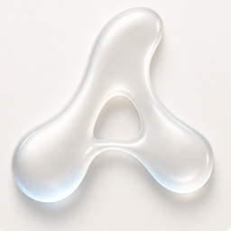
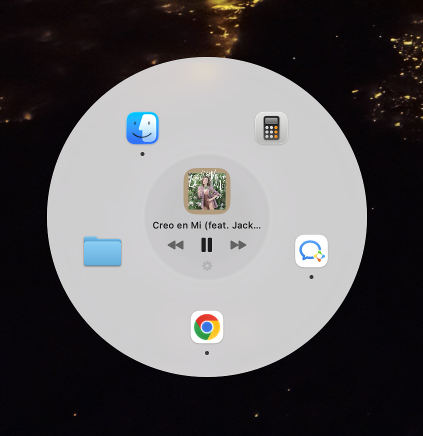
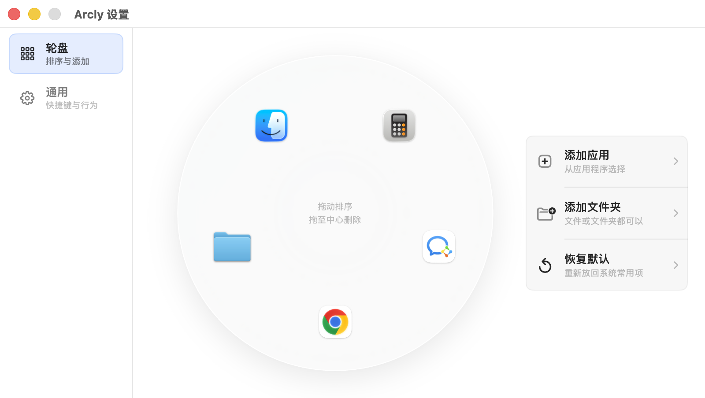
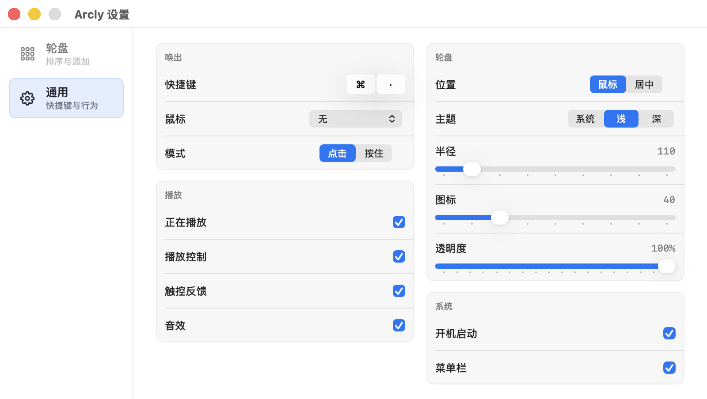

# Arcly

<p align="center">
  
</p>

<p align="center">
  <strong>A liquid-glass command wheel for macOS.</strong><br>
  <strong>一款 macOS 液态玻璃轮盘启动器。</strong>
</p>

<p align="center">
  
  
  
  
</p>

Arcly puts your everyday Mac actions under your cursor: launch apps, open files and folders, and control music from a quiet radial menu.

Arcly 把高频操作放到鼠标附近：启动应用、打开文件和文件夹、控制音乐，都在一个轻量的轮盘里完成。

## Preview / 预览

<p align="center">
  
</p>

<p align="center">
  
</p>

<p align="center">
  
</p>

## Highlights / 亮点

- Liquid-glass radial menu that floats above the desktop  
  液态玻璃质感的 macOS 轮盘，轻盈覆盖在当前工作区上
- Launch apps, files, and folders from fixed wheel slots  
  常用应用、文件、文件夹可以固定到轮盘槽位
- Music display and playback controls in the center  
  中心区域显示当前音乐，并支持播放控制
- Hotkey and mouse-trigger launch modes  
  支持快捷键唤出，也支持鼠标按键触发
- Adjustable radius, icon size, opacity, theme, and position  
  可调整半径、图标大小、透明度、主题和唤出位置
- English and Simplified Chinese UI, following the macOS system language  
  支持英文和简体中文界面，自动跟随 macOS 系统语言

## Download / 下载

For normal users, Arcly should be distributed through **GitHub Releases** as a DMG or ZIP installer.

普通用户应该从 **GitHub Releases** 下载 DMG 或 ZIP 安装包，而不是直接下载源码。

Current status:

当前状态：

- Source code is available in this repository.  
  当前仓库已经提供源码。
- A one-click installer is not published in this README yet.  
  README 里还没有发布一键安装包。
- For the smoothest install experience, the DMG should be code-signed and notarized by Apple.  
  想让别人打开时不被系统拦截，DMG 最好做 Apple 签名和 notarization。

## Build From Source / 从源码构建

```bash
xcodebuild -project Arcly.xcodeproj -scheme Arcly -configuration Release build
```

The bundle identifier still uses `com.qingshan.orbis` to preserve update and in-app purchase compatibility. The user-facing app name is `Arcly`.

为了兼容旧版本更新和内购，bundle identifier 仍然保留 `com.qingshan.orbis`；用户看到的名称是 `Arcly`。

## Notes / 说明

- Self-distributed local builds should be signed without the App Sandbox entitlement if MediaRemote music metadata is required.  
  如果需要读取系统音乐信息，本地分发版需要避免使用 App Sandbox entitlement。
- App Store distribution should keep the normal App Store signing and sandbox flow.  
  App Store 版本仍应使用正常的 App Store 签名和 sandbox 流程。

## Support / 支持

If Arcly matches the way you like to work on macOS, starring the repo helps more people find it.

如果你喜欢这种 macOS 轮盘式工作流，给这个仓库一个 star 会帮助更多人看到它。
